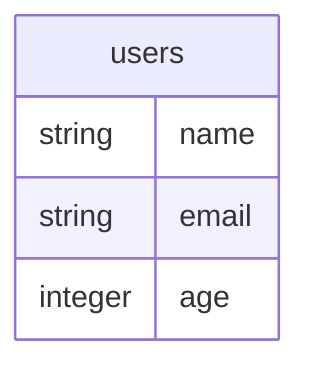
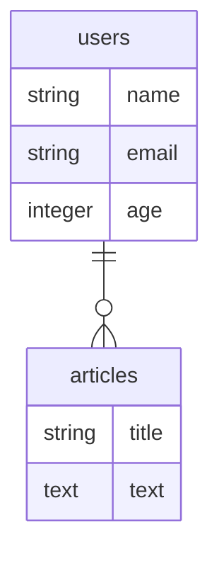
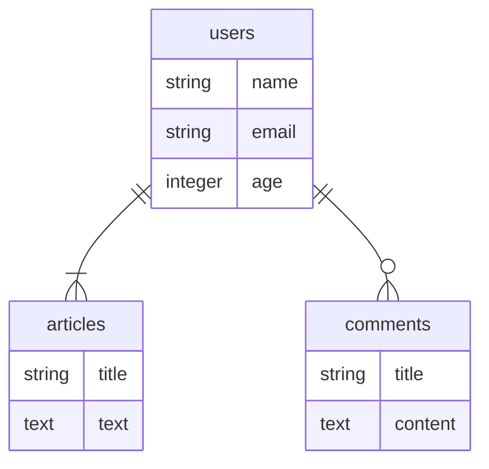
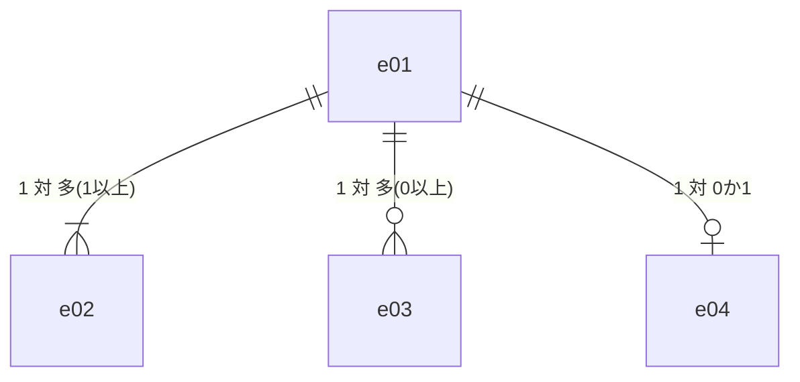

## ファイルの作成

MermaidでER図を描く場合にはerDiagramで始めます。  

````sample.md
```mermaid
erDiagram

```

````

以降の記述は`@startuml`と`@enduml`の間に記述します。  

## エンティティ

エンティティは以下のように記述します。  

````sample.md


````


## リレーション

リレーションは以下のように記述します。  

````sample.md


````



````sample.md


````


