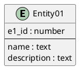
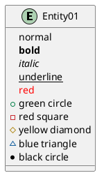
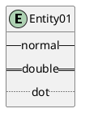
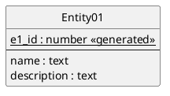
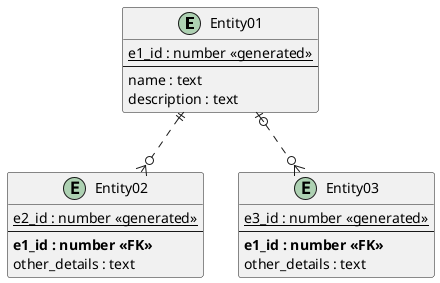
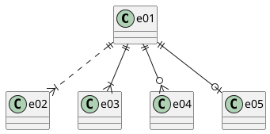
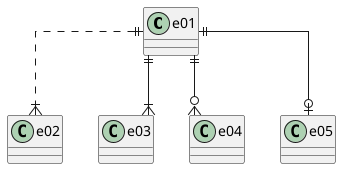
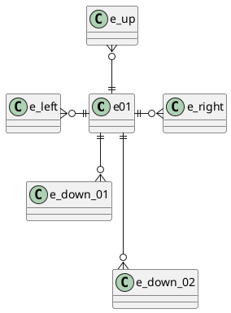

## ファイルの作成

ER図の作成のために以下のいずれかの拡張子のファイルを作成します。  

- `*.wsd`
- `*.pu`
- `*.puml`
- `*.plantuml`
- `*.iuml`

ファイルの先頭に`@startuml`を末尾に`@enduml`を記述します。  
`@startuml`に続けてダイアグラム名を記述します。  

```sample.pu
@startuml Sample

@enduml

```

以降の記述は`@startuml`と`@enduml`の間に記述します。  

## エンティティ

エンティティは以下のように記述します。  

```sample.pu
@startuml Sample

entity "Entity01" as e01 {
e1_id : number
--
name : text
description : text
}

@enduml

```



各カラムに記号をつけたり文字装飾ができます。  

```sample.pu
@startuml Sample

entity "Entity01" as e01 {
  normal
  <b>bold
  <i>italic
  <u>underline
  <color:RED>red
  +green circle
  -red square
  #yellow diamond
  ~blue triangle
  *black circle
}

@enduml

```



またセパレータを描画できます。  

```sample.pu
@startuml Sample

entity "Entity01" as e01 {
  -- normal --
  == double ==
  .. dot ..
}

@enduml

```



各エンティティのEのマークを非表示にするには`hide circle`を追記します。  

```sample.pu
@startuml Sample
hide circle

entity "Entity01" as e01 {
<u>e1_id : number <<generated>>
--
name : text
description : text
}

@enduml

```



## リレーション

リレーションは以下のように記述します。  

```sample.pu
@startuml Sample

entity "Entity01" as e01 {
<u>e1_id : number <<generated>>
--
name : text
description : text
}
entity "Entity02" as e02 {
<u>e2_id : number <<generated>>
--
<b>e1_id : number <<FK>>
other_details : text
}
entity "Entity03" as e03 {
<u>e3_id : number <<generated>>
--
<b>e1_id : number <<FK>>
other_details : text
}

e01 ||..o{ e02
e01 |o..o{ e03

@enduml

```



```sample.pu
@startuml Sample

e01 ||..|{ e02
e01 ||--|{ e03
e01 ||--o{ e04
e01 ||--o| e05

@enduml

```



リレーションのラインの表示方法を変更するには`skinparam linetype`を変更します。  

```sample.pu
@startuml Sample
skinparam linetype ortho

e01 ||..|{ e02
e01 ||--|{ e03
e01 ||--o{ e04
e01 ||--o| e05

@enduml

```



また次のように記述することで配置調整ができます。　　

```sample.pu
@startuml Sample

e01 ||-l-o{ e_left
e01 ||-u-o{ e_up
e01 ||-r-o{ e_right
e01 ||-d-o{ e_down_01
e01 ||--d-o{ e_down_02

@enduml

```


