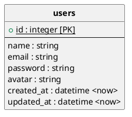
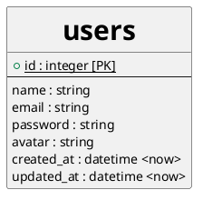

## デフォルト

```
@startuml 
hide circle

entity "<b>users" as users {
+<u>id : integer [PK]
--
name : string
email : string
password : string
avatar : string
created_at : datetime <now>
updated_at : datetime <now>
}

@enduml
```




## 全体的に変更する
```:sample.pu
@startuml 
skinparam ClassFontSize 30
hide circle

entity "<b>users" as users {
+<u>id : integer [PK]
--
name : string
email : string
password : string
avatar : string
created_at : datetime <now>
updated_at : datetime <now>
}

@enduml
```



## 部分的に変更する


```:sample.pu
@startuml 
hide circle

entity "<b><size:30>users" as users {
+<u>id : integer [PK]
--
name : string
email : string
password : string
avatar : string
created_at : datetime <now>
updated_at : datetime <now>
}

@enduml
```


