## PlantUMLでリンクを貼る方法

次のように`[[URL{tooltip} label]]`と記述することでPlantUMLにリンクを貼ることができます。

```:sample.puml
@startuml Sample
skinparam ClassFontSize 30

entity "[[https://example.com{example.com} users]]" as users {
}
@enduml
```

```plantuml
@startuml Sample
skinparam ClassFontSize 30

entity "[[https://example.com{ツールチップ} users]]" as users {
}
@enduml
```



## 参考

https://plantuml.com/ja/link#:~:text=%E3%83%95%E3%82%A9%E3%83%BC%E3%83%9E%E3%83%83%E3%83%88%E5%AE%9A%E7%BE%A9-,%E3%82%B7%E3%83%B3%E3%83%97%E3%83%AB%E3%81%AA%E3%83%AA%E3%83%B3%E3%82%AF,-%E3%82%B7%E3%83%B3%E3%83%97%E3%83%AB%E3%81%AA%E3%83%AA%E3%83%B3%E3%82%AF
